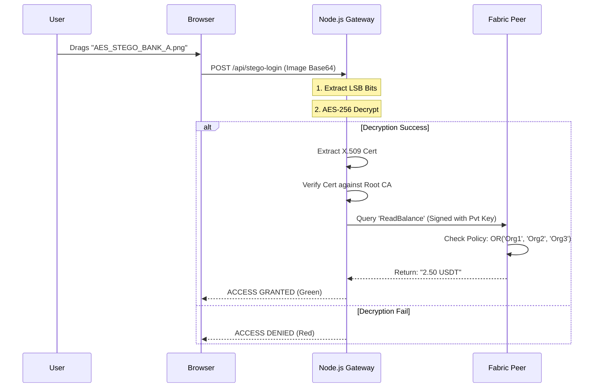

# Private USDT Reserve Vault: Hyperledger Fabric PoC

A Proof-of-Concept implementation of a privacy-preserving stablecoin reserve system built on **Hyperledger Fabric v2.5**. This project demonstrates how regulated financial institutions can utilize distributed ledger technology (DLT) to share liquidity data with regulators while maintaining strict data confidentiality against unauthorized network participants.

## 1. Executive Summary

Traditional public blockchains (Layer 1s) prioritize transparency, making them unsuitable for banking consortia where reserve balances are trade secrets.

This solution leverages **Hyperledger Fabric Private Data Collections (PDC)** to achieve **Data Segregation**. The actual asset value (USDT Balance) is stored in a private side-database (SideDB) accessible only to whitelisted organizations (Bank A, Bank B, and the Regulator). The public ledger records only a cryptographic hash of the data, ensuring immutability without compromising confidentiality.

## 2. Technical Architecture

The system follows a three-tier architecture:

```mermaid

graph TD
    subgraph "Fabric Network (Docker)"
        O[Orderer Node<br>(Raft Consensus)]
        
        subgraph "Org1 (Bank A)"
            P1[Peer0.Org1]
            DB1[(Private SideDB)]
            P1 <--> DB1
        end
        
        subgraph "Org2 (Bank B)"
            P2[Peer0.Org2]
            DB2[(Private SideDB)]
            P2 <--> DB2
        end
        
        subgraph "Org3 (Regulator)"
            P3[Peer0.Org3]
            DB3[(Private SideDB)]
            P3 <--> DB3
        end
    end

    %% Connections
    P1 -.-> O
    P2 -.-> O
    P3 -.-> O
    
    %% Gossip
    P1 -- "Gossip (2.50 USDT)" --> P2
    P1 -- "Gossip (2.50 USDT)" --> P3
    
    style DB1 fill:#f9f,stroke:#333,stroke-width:2px
    style DB2 fill:#f9f,stroke:#333,stroke-width:2px
    style DB3 fill:#f9f,stroke:#333,stroke-width:2px

```

### Tier 1: The Blockchain Network (Infrastructure)
* **Framework:** Hyperledger Fabric v2.5.
* **Consensus:** Raft (EtcdRaft) Ordering Service.
* **Topology:** Three Organizations (Bank A, Bank B, Regulator) and one Orderer.
* **Containerization:** Docker & Docker Compose.

### Tier 2: The Logic Layer (Smart Contract)
* **Language:** Go (Golang).
* **Mechanism:** Uses `PutPrivateData` and `GetPrivateData` to bypass the public block storage.
* **Policy:** `OR('Org1MSP.member', 'Org2MSP.member', 'Org3MSP.member')`. This endorsement policy enforces that only the three authorized entities possess the decryption keys for the private data.

### Tier 3: The Application Layer (Gateway & Auth)
* **API:** Node.js with Express.
* **Connectivity:** Hyperledger Fabric Gateway SDK (gRPC).
* **Authentication:** **Steganographic Identity Injection**. A custom security module that embeds AES-256 encrypted X.509 certificates into the Least Significant Bits (LSB) of PNG images to simulate physical hardware token access.

## 3. Security Specifications

### Data Privacy (PDC)
Data privacy is enforced at the peer level. When a transaction is submitted:
1.  **Transient Data:** The payload (`2.50 USDT`) is sent via a transient field, ensuring it is never written to the orderer's logs.
2.  **Gossip Protocol:** The data is disseminated solely to peers defined in the `collections_config.json` policy.
3.  **Hashing:** A SHA256 hash of the data is written to the public ledger for auditability and tamper-proofing.

### Authentication (AES-LSB Steganography)


To demonstrate robust identity management without traditional passwords, the application implements a "Digital Physical Key" model:
1.  **Input:** The user provides an X.509 Certificate (`.pem`).
2.  **Encryption:** The certificate is encrypted using AES-256 (Symmetric Encryption).
3.  **Embedding:** The encrypted payload is injected into the Blue Channel LSB of a PNG image.
4.  **Verification:** Upon login, the server extracts the bits, decrypts the payload, and verifies the certificate against the Trusted Root CA before allowing access to the Fabric Gateway.

## 4. Installation and Setup

### Prerequisites
* Operating System: Linux (Ubuntu) or WSL2 (Windows Subsystem for Linux).
* Docker Desktop (Running).
* Node.js v18 or higher.
* Go v1.20 or higher.

### Step 1: Initialization
Run the automated DevOps script to provision the network, create the channel, and deploy the chaincode.

```bash
cd test-network
./start_demo.sh

```
This script performs the following operations:
Cleans previous Docker containers and volumes.
Starts Peers for Org1 (Bank A) and Org2 (Bank B).
Dynamically adds Org3 (Regulator) to the channel configuration.
Deploys the usdt-secret chaincode with private data policies.
Mints the initial asset (2.50 USDT) into the private collection.
Starts the Node.js API server.

### Step 2: Generate Access Keys
To access the system, you must generate the steganographic access images.
Navigate to the application directory: cd ~/fabric-samples/asset-transfer-private-data/chaincode-go/usdt-secret/application-gateway
Ensure a source image named input.png exists in the folder.
Run the encoder: node secure_encoder.js
This creates AES_STEGO_BANK_A.png. This image acts as your login credential.

### Step 3: Usage
Open http://localhost:3000 in a web browser.

Drag and drop the generated AES_STEGO_BANK_A.png into the drop zone.

***Success**: The system extracts the certificate, authenticates as Bank A, and retrieves the private balance.

***Failure**: Dragging an unencrypted image or an image encrypted for a non-whitelisted entity will result in an "Access Denied" error from the Fabric Peer.

### 5. Project Structure
chaincode-go/: Contains the Go smart contract logic and private data configuration.

application-gateway/: Contains the Node.js API, Steganography logic (secure_encoder.js), and the Frontend (index.html).

test-network/: Contains the network configuration and the start_demo.sh automation script.

### 6. Future Enhancements for Production
For a production deployment, the following upgrades are recommended:

Infrastructure: Migration from Docker Compose to Kubernetes (K8s) for high availability.

Key Management: Transition from file-based keystores to Hardware Security Modules (HSM) or HashiCorp Vault.

Database: Implementation of CouchDB to support complex rich queries on the private data collections.